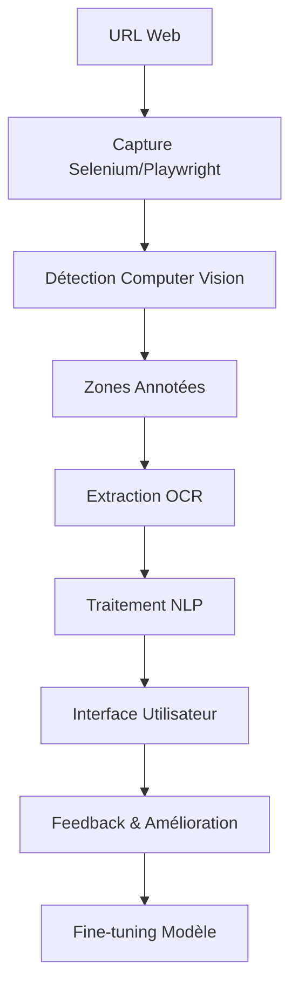

## 🚀 Installation Rapide

### Prérequis
- Python 3.9 ou supérieur
- 8+ GB RAM (16 GB recommandé)
- GPU NVIDIA optionnel (améliore les performances)

### Installation

```bash
# Clonage du projet
git clone https://github.com/ZIADEA/SmartWebScraper-CV.git
cd SmartWebScraper-CV/LocalApp/SMARTWEBSCRAPPER-CV

# Environnement virtuel (optionnel)
python -m venv venv
source venv/bin/activate  # Linux/Mac
# ou venv\Scripts\activate  # Windows

# Dépendances
pip install -r requirements.txt

# Modèles NLP
python -c "import nltk; nltk.download('punkt'); nltk.download('stopwords')"
python -m spacy download fr_core_news_sm

# Detectron2 (voir guides spécifiques selon votre OS)
pip install 'git+https://github.com/facebookresearch/detectron2.git'
```

### Configuration

1. **Créer le fichier .env avec votre clé API Gemini :**
```bash
GEMINI_API_KEY=your-gemini-api-key
ADMIN_EMAIL=admin@example.com
ADMIN_PASSWORD=your_password
```

2. **Installer et lancer Ollama (optionnel) :**
```bash
# Télécharger depuis https://ollama.com/
ollama run mistral
```

3. **Lancer l'application :**
```bash
python run.py
```

4. **Accéder aux interfaces :**
- Interface utilisateur : http://localhost:5000
- Interface admin : http://localhost:5000/admin/login

## 📖 Documentation Complète

La documentation complète est disponible sur ReadTheDocs :

[](https://smartwebscraper-cv.readthedocs.io/)

### 📚 Sections Principales

- [⚙️ Installation Locale](docs/source/installation/local.rst)
- [🚀 Distribution et Support](docs/source/deployment/distribution.rst)🎯 Introduction et Contexte](docs/source/introduction/contexte.rst)
- [📊 Acquisition des Données](docs/source/data/constitution.rst)
- [🏷️ Annotation et Dataset](docs/source/annotation/objectifs.rst)
- [🤖 Modélisation Computer Vision](docs/source/modeling/detection.rst)
- [📝 Traitement NLP](docs/source/nlp/traitement.rst)
- [🏗️ Architecture Application](docs/source/architecture/structure.rst)
- [# SmartWebScraper-CV

[](https://www.python.org/downloads/)
[](https://opensource.org/licenses/MIT)
[](https://smartwebscraper-cv.readthedocs.io/fr/latest/?badge=latest)

> **Application intelligente d'annotation de pages web par Computer Vision, OCR, NLP et LLM**

Projet de fin d'année - ENSAM Meknès, Filière IATD-SI  
**Auteurs :** DJERI-ALASSANI OUBENOUPOU & EL MAJDI WALID  
**Encadrant :** Professeur Tawfik MASROUR  
**Date :** 16 Juin 2025

## 🎯 Aperçu du Projet

SmartWebScraper-CV révolutionne l'extraction de contenu web en combinant plusieurs technologies d'IA pour analyser visuellement les pages web, contournant ainsi les limitations du scrapping traditionnel (obfuscation HTML, JavaScript, contenu dynamique).

### 🚀 Fonctionnalités Principales

- **🖼️ Capture Intelligente** : Screenshot automatique avec gestion du contenu dynamique
- **🎯 Détection Automatique** : 18 zones fonctionnelles détectées (header, content, ads, etc.)
- **📝 OCR Avancé** : Extraction précise du texte avec PaddleOCR
- **🧠 Analyse NLP** : Résumé, Q&A, extraction d'entités avec NLTK/spaCy
- **🤖 IA Générative** : Intégration Gemini API et Mistral (Ollama)
- **👨‍💼 Double Interface** : Utilisateur final + Administrateur pour validation

## 🏗️ Architecture Technique



### 🛠️ Technologies Utilisées

| Domaine | Technologies |
|---------|-------------|
| **Computer Vision** | Detectron2, Faster R-CNN, annotations COCO |
| **OCR** | PaddleOCR, prétraitement OpenCV |
| **NLP** | NLTK, spaCy, TF-IDF, Word2Vec, clustering |
| **LLM** | Gemini API, Mistral via Ollama |
| **Web Framework** | Flask, HTML5 Canvas, interface responsive |
| **Web Scraping** | Selenium, undetected-chromedriver, Playwright |

## 📊 Performances

| Métrique | Score | Description |
|----------|-------|-------------|
| **mAP Détection** | 41.6% | Précision moyenne détection d'objets |
| **Qualité OCR** | >90% | Taux d'extraction sur texte net |
| **Temps Traitement** | 4-6s | Capture + détection + OCR + NLP |
| **Classes Détectées** | 18+1 | Zones fonctionnelles web |

## 🚀 Installation Rapide

### Prérequis
- Python 3.9-3.10
- 8+ GB RAM (16 GB recommandé)
- GPU NVIDIA optionnel (améliore les performances)

### Installation Automatique

```bash
# Clonage du projet
git clone https://github.com/ZIADEA/SmartWebScraper-CV.git
cd SmartWebScraper-CV/LocalApp/SMARTWEBSCRAPPER-CV

# Installation automatique
python setup.py
```

### Installation Manuelle

```bash
# Environnement virtuel
python -m venv venv
source venv/bin/activate  # Linux/Mac
# ou venv\Scripts\activate  # Windows

# Dépendances
pip install -r requirements.txt

# Modèles NLP
python -c "import nltk; nltk.download('punkt'); nltk.download('stopwords')"
python -m spacy download fr_core_news_sm

# Detectron2
pip install 'git+https://github.com/facebookresearch/detectron2.git'
```

### Configuration

1. **Copier le fichier de configuration :**
```bash
cp .env.example .env
```

2. **Configurer les clés API dans `.env` :**
```bash
GEMINI_API_KEY=your-gemini-api-key
SERPAPI_KEY=your-serpapi-key
OLLAMA_BASE_URL=http://localhost:11434
```

3. **Lancer l'application :**
```bash
python run.py
```

4. **Accéder aux interfaces :**
- Interface utilisateur : http://localhost:5000
- Interface admin : http://localhost:5000/admin/login

## 📖 Documentation Complète

La documentation complète est disponible sur ReadTheDocs :

[](https://smartwebscraper-cv.readthedocs.io/)

### 📚 Sections Principales

- [🎯 Introduction et Contexte](docs/source/introduction/contexte.rst)
- [📊 Acquisition des Données](docs/source/data/constitution.rst)
- [🏷️ Annotation et Dataset](docs/source/annotation/objectifs.rst)
- [🤖 Modélisation Computer Vision](docs/source/modeling/detection.rst)
- [📝 Traitement NLP](docs/source/nlp/traitement.rst)
- [🏗️ Architecture Application](docs/source/architecture/structure.rst)
- [⚙️ Guide d'Installation Locale](docs/source/installation/local.rst)
- [🔄 Workflow Complet](docs/source/usage/workflow.rst)
- [🚀 Distribution et Support](docs/source/deployment/distribution.rst)

## 🎮 Utilisation

### Interface Utilisateur

1. **Soumission d'URL** : Entrez l'URL de la page à analyser
2. **Capture Automatique** : Screenshot et détection des zones
3. **Sélection des Zones** : Choisissez les éléments à analyser
4. **Extraction de Contenu** : OCR et traitement NLP automatique
5. **Interaction Intelligente** : Questions, résumés, analyses

### Interface Administrateur

1. **Validation d'Annotations** : Contrôle qualité des prédictions
2. **Correction Manuelle** : Amélioration des données d'entraînement
3. **Fine-tuning** : Relancement de l'entraînement avec nouvelles données
4. **Métriques** : Suivi des performances du système

## 🔧 API et Intégration

### API REST

```python
# Exemple d'utilisation de l'API
import requests

# Capture et analyse d'une page
response = requests.post('http://localhost:5000/api/analyze', 
                        json={'url': 'https://example.com'})

result = response.json()
# result contient : zones détectées, texte extrait, métadonnées
```

### Docker

```bash
# Construction de l'image
docker build -t smartwebscraper .

# Lancement avec volumes persistants
docker run -p 5000:5000 -v $(pwd)/data:/app/data smartwebscraper
```

## 🎯 Cas d'Usage

- **🔍 Analyse UX/UI** : Détection automatique des zones publicitaires
- **📚 Recherche Académique** : Constitution de corpus textuels annotés
- **🤖 Entraînement IA** : Dataset COCO de pages web réelles
- **📊 Veille Concurrentielle** : Extraction automatisée de contenu
- **♿ Accessibilité** : Amélioration de la navigation pour malvoyants

## 🛡️ Résolution de Problèmes

### Erreurs Courantes

| Erreur | Solution |
|--------|----------|
| `CUDA out of memory` | Définir `FORCE_CPU_MODE=True` dans `.env` |
| `ModuleNotFoundError: detectron2` | Réinstaller via GitHub : `pip install 'git+https://github.com/facebookresearch/detectron2.git'` |
| `spaCy model not found` | `python -m spacy download fr_core_news_sm` |
| `PaddleOCR download failed` | Vérifier connexion Internet et réessayer |

### Performance

```bash
# Mode CPU forcé (machines limitées)
export FORCE_CPU_MODE=True

# Logs détaillés pour debug
export FLASK_DEBUG=1
python run.py 2>&1 | tee logs/debug.log
```

## 🤝 Contribution

Nous accueillons les contributions ! Voici comment participer :

1. **Fork** le projet
2. **Créer** une branche (`git checkout -b feature/amélioration`)
3. **Commit** vos changements (`git commit -am 'Ajout nouvelle fonctionnalité'`)
4. **Push** vers la branche (`git push origin feature/amélioration`)
5. **Créer** une Pull Request

### 🐛 Signaler un Bug

Utilisez les [GitHub Issues](https://github.com/votre-repo/SmartWebScraper-CV/issues) avec :
- Description détaillée du problème
- Étapes de reproduction
- Logs d'erreur
- Configuration système

## 📈 Roadmap

### Version 2.0 (Prévue)
- [ ] Support multilingue complet
- [ ] API REST publique
- [ ] Interface mobile responsive
- [ ] Apprentissage par renforcement (RLHF)
- [ ] Dashboard analytics temps réel

### Version 2.1 (Future)
- [ ] Intégration cloud (AWS, GCP)
- [ ] Mode batch processing
- [ ] Plugin navigateur
- [ ] Support vidéos web

## 📄 Licence

Ce projet est sous licence MIT. Voir le fichier [LICENSE](LICENSE) pour plus de détails.

## 🙏 Remerciements

- **ENSAM Meknès** - Cadre académique et infrastructure
- **Professeur Tawfik MASROUR** - Encadrement et conseils
- **Facebook AI Research** - Detectron2 framework
- **Google** - Gemini API et modèles de base
- **Communauté Open Source** - Outils et bibliothèques

## 📞 Contact

- **DJERI-ALASSANI OUBENOUPOU** - [email@example.com]
- **EL MAJDI WALID** - [email@example.com]
- **Projet** - [GitHub](https://github.com/votre-repo/SmartWebScraper-CV)
- **Documentation** - [ReadTheDocs](https://smartwebscraper-cv.readthedocs.io/)

---

<div align="center">

**🎓 ENSAM Meknès - IATD-SI 2025**  
*Ingénierie de l'Intelligence Artificielle et des Technologies de la Donnée pour les Systèmes Industriels*

</div>
