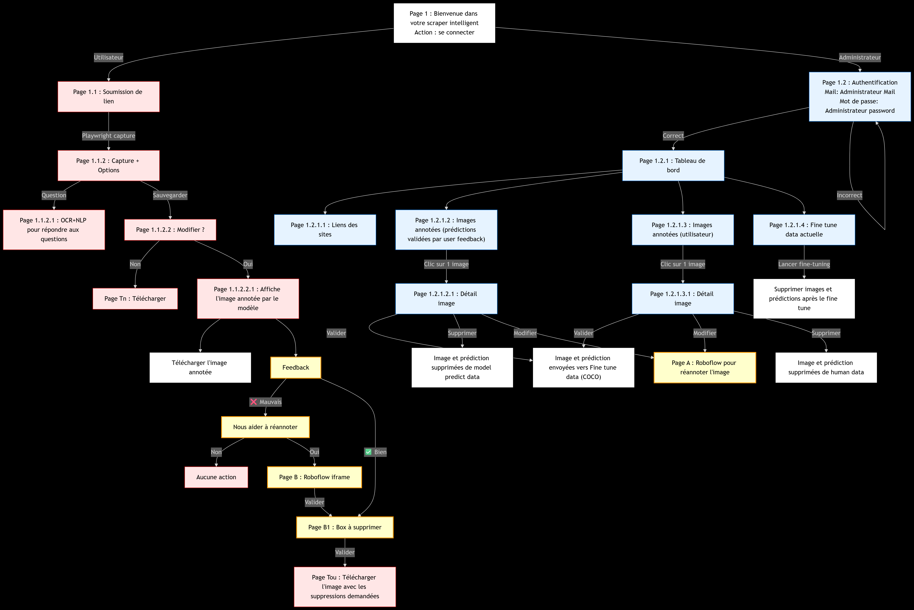
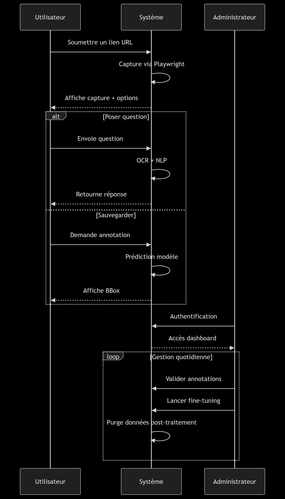

Utilisation
===========

L’interface utilisateur est en cours de développement.

En attendant, vous pouvez tester le modèle via le notebook suivant :

.. code-block:: none

    notebooks/CV_model_demo.ipynb

Ce notebook permet de charger une image et d’obtenir les prédictions du modèle de détection entraîné.

Exemple d'exécution
-------------------

1. Ouvrir le notebook dans Jupyter Notebook ou Google Colab.
2. Exécuter les cellules pour charger le modèle et tester une image.
3. Les résultats s’affichent visuellement.

Workflow de l'application
-----------------------------

use case Diagramme
-----------------------------
